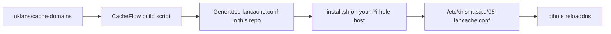

# CacheFlow

CacheFlow keeps your Pi-hole pointed at a LanCache server using domain lists from [uklans/cache-domains](https://github.com/uklans/cache-domains). The repo ships a ready-to-install `dnsmasq` config that maps supported domains to your cache IP, and GitHub Actions rebuilds it every week so the coverage stays current.

## Why use it

- One command install on a Pi-hole host
- No manual list wrangling or domain deduplication
- Weekly automated rebuilds from upstream cache-domain data
- Safe installer that validates the downloaded config before replacing the live file

## Requirements

- A running [Pi-hole](https://pi-hole.net/) instance
- A running [LanCache](https://lancache.net/) server on your network
- `curl` available on the Pi-hole host

## Install

Run this on your Pi-hole machine and replace the sample IP with your LanCache server address:

```bash
curl -fsSL https://raw.githubusercontent.com/sparksbenjamin/CacheFlow/main/install.sh | sudo bash -s -- 192.168.1.100
```

The installer will:

1. Download the latest generated `lancache.conf` from this repo
2. Replace `LANCACHE_IP` with your LanCache server IP
3. Validate that the config still contains real `dnsmasq` rules
4. Atomically write `/etc/dnsmasq.d/05-lancache.conf`
5. Reload Pi-hole DNS

To refresh later, run the same command again.

## How it works



- The heavy work happens in GitHub Actions, not on your Pi-hole host.
- Your Pi-hole only downloads a single generated config and swaps in your IP so matching domains resolve directly to the cache.
- The workflow runs weekly on Sunday at 03:00 UTC, and you can also run it manually from the Actions tab.

## What gets cached

Coverage is driven by [uklans/cache-domains](https://github.com/uklans/cache-domains). Typical platforms include:

- Steam
- Epic Games
- Battle.net / Blizzard
- Xbox / Microsoft
- PlayStation
- EA / Origin
- Ubisoft
- Riot Games
- Nintendo
- Warframe

See the upstream project for the current full list.

## Updating automatically

If you want your Pi-hole to refresh on its own after the weekly build, add a cron job on the Pi-hole host:

```bash
# Refresh every Monday at 04:00 local time
0 4 * * 1 curl -fsSL https://raw.githubusercontent.com/sparksbenjamin/CacheFlow/main/install.sh | sudo bash -s -- 192.168.1.100
```

## Uninstall

```bash
sudo rm /etc/dnsmasq.d/05-lancache.conf
sudo pihole reloaddns
```

## Repository layout

- `install.sh`: installer for Pi-hole hosts
- `scripts/build_lancache_conf.py`: generates the config from upstream domains
- `.github/workflows/update-conf.yml`: weekly rebuild automation
- `lancache.conf`: latest generated config consumed by the installer

## Credits

Domain lists are provided by [uklans/cache-domains](https://github.com/uklans/cache-domains).
