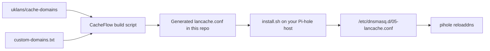

# CacheFlow

CacheFlow is a set-it-and-forget-it DNS integration for [LanCache](https://lancache.net/) environments that already have a DNS layer in place.

It generates and maintains a Pi-hole-compatible `dnsmasq` configuration from the upstream [uklans/cache-domains](https://github.com/uklans/cache-domains) project, publishes the latest version to this repository, and gives you a one-command installer to point supported game download traffic at your LanCache server.

The goal is simple: deploy it once, keep it current automatically, and stop babysitting cache domain lists by hand.

## Why CacheFlow

- Built for environments that already have DNS infrastructure and want LanCache routing without redesigning the stack
- One-command deployment to a Pi-hole host
- Weekly automated rebuilds from upstream cache-domain data
- Minimal maintenance after setup
- Safe installer with validation and atomic config replacement
- Support for repo-managed custom cache domains when upstream coverage needs help

## Ideal use case

CacheFlow is a strong fit when:

- Pi-hole is already part of your network
- LanCache is already deployed or planned
- You want game download traffic redirected to cache without manually maintaining domain rules
- You prefer a DNS-layer solution that can be updated centrally and rolled out repeatedly

If your environment already has a stable DNS setup, CacheFlow lets you add LanCache routing without turning domain management into an ongoing task.

## Requirements

- A running [Pi-hole](https://pi-hole.net/) instance
- A running [LanCache](https://lancache.net/) server on your network
- `curl` available on the Pi-hole host

## Install

Run this on your Pi-hole machine and replace the sample IP with your LanCache server address:

```bash
curl -fsSL https://raw.githubusercontent.com/sparksbenjamin/CacheFlow/main/install.sh | sudo bash -s -- 192.168.1.100
```

The installer will:

1. Download the latest generated `lancache.conf` from this repo
2. Inject your LanCache server IP
3. Validate that the config contains valid `dnsmasq` address rules
4. Atomically write `/etc/dnsmasq.d/05-lancache.conf`
5. Enable `/etc/dnsmasq.d` loading on Pi-hole v6 when needed
6. Reload Pi-hole DNS

After that, the deployment is effectively hands-off. Re-run the same command any time you want to refresh immediately, or automate it with a scheduled task.

## How it works



- GitHub Actions rebuilds the config every week from upstream cache-domain sources
- The generated file is published directly in this repository
- Your Pi-hole host only needs to download the finished config and apply your LanCache IP
- Custom entries can be merged in without forking the upstream project

## What this solves

Without CacheFlow, running LanCache alongside an existing DNS setup often turns into one of these problems:

- manually tracking changes in cacheable domains
- rebuilding local config files by hand
- trying to keep Pi-hole and LanCache aligned over time
- losing confidence that cache routing is still current months after deployment

CacheFlow addresses that by making the DNS side reproducible, updateable, and easy to redeploy.

## Coverage

Coverage is driven primarily by [uklans/cache-domains](https://github.com/uklans/cache-domains). Typical platforms include:

- Steam
- Epic Games
- Battle.net / Blizzard
- Xbox / Microsoft
- PlayStation
- EA / Origin
- Ubisoft
- Riot Games
- Nintendo
- Warframe

See the upstream project for the current full platform list.

## Custom domains

If upstream coverage misses a download host you need, add it to [`custom-domains.txt`](E:/projects/CacheFlow/custom-domains.txt:1), one entry per line.

Example:

```text
cdn.example-game.com
patches.example-studio.net
downloads.example-platform.com
```

The build process merges this file with upstream domains, removes duplicates, and publishes a single combined `lancache.conf`.

## Keeping it updated

CacheFlow is designed to stay current without much attention:

- The repository rebuilds `lancache.conf` automatically every week
- You can trigger a manual rebuild from the GitHub Actions tab whenever needed
- You can re-run the installer at any time to pull the newest config

If you want your Pi-hole host to refresh automatically after the weekly rebuild, add a cron job:

```bash
# Refresh every Monday at 04:00 local time
0 4 * * 1 curl -fsSL https://raw.githubusercontent.com/sparksbenjamin/CacheFlow/main/install.sh | sudo bash -s -- 192.168.1.100
```

## Uninstall

```bash
sudo rm /etc/dnsmasq.d/05-lancache.conf
sudo pihole reloaddns
```

## Repository layout

- `install.sh`: installer for Pi-hole hosts
- `scripts/build_lancache_conf.py`: generates the config from upstream and custom domains
- `custom-domains.txt`: repo-managed extra domains merged into the generated config
- `.github/workflows/update-conf.yml`: weekly rebuild automation
- `lancache.conf`: latest generated config consumed by the installer

## Credits

Domain lists are provided by [uklans/cache-domains](https://github.com/uklans/cache-domains).
